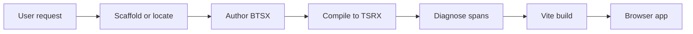

<!-- markdownlint-disable MD013 -->

# Beast Skill

> Agent skill for building, debugging, and shipping Beast BTSX → TSRX → Octane apps — fast.

[](https://skills.sh/phtn/beast-skill/beast)
[](package.json)
[](package.json)
[](https://octanejs.dev/)
[](LICENSE)

**Scaffold in seconds. Author with indentation. Compile to native TSRX. Let Octane own rendering.**

[Install](#installation) ·
[How it works](#how-it-works) ·
[CLI reference](#cli-reference) ·
[Diagnostics](#diagnostics) ·
[Development](#development)

---

Beast Skill is an agent skill for the [Beast](https://github.com/phtn/beast) compiler — an indentation-first language that compiles `.btsx` into readable `.tsrx` for [Octane](https://octanejs.dev/) and [Vite](https://vite.dev/). It gives LLM agents a deterministic workflow to scaffold, author, diagnose, and build Beast apps without reading the full compiler.

It does not replace TypeScript, TSRX, Octane, or Vite. It owns the authoring-to-build loop and hands generated TSRX to the existing toolchain.

## At a glance

| Capability | What it does | Why it matters |
| --- | --- | --- |
| Scaffold | Creates a typed Beast + Octane + Vite app | Starts with evidence |
| Author | Indentation-based BTSX with typed props | Keeps structure, keeps types |
| Compile | BTSX → native TSRX (readable) | Octane remains authority |
| Diagnose | Stable codes + source spans | Makes failures actionable |
| Build | Validates mixed BTSX/TSRX, Vite in-memory | Ships with confidence |

## Installation

Install the skill from GitHub:

```bash
npx skills add https://github.com/phtn/beast-skill --skill beast
```

Then invoke it from a supported agent:

```text
Use $beast to create a new Beast app in ./my-app and build it.
```

Narrow to a file or task:

```text
Use $beast to fix diagnostics in src/App.btsx and show the compiled TSRX diff.
```

```text
Use $beast to scaffold a Beast project without git, then add a keyed list with empty fallback.
```

> [!NOTE]
> The skill workflow verifies, not assumes. A clean `bun run check` (typecheck + test + build) is the ship signal.

## How it works



Beast deliberately generates native TSRX — conditions and loops remain template operations, output stays readable, and Octane validates final semantics.

Given this BTSX:

```btsx
module
  interface Props {
    title: string
    links: { id: string, label: string, url: string }[]
  }
props { title, links }: Props
main.app
  p.eyebrow BTSX → TSRX → Octane
  h1 #{title}
  div.flex
    each link in links key link.id
      a.button(id={link.id} href={link.url}) #{link.label}
```

Beast produces this TSRX shape:

```tsrx
export default function App({ title, links }: Props) @{
  <div className="app">
    <p className="eyebrow">BTSX → TSRX → Octane</p>
    <h1>{title}</h1>
    <div className="flex">
      @for (const link of links; key link.id) {
        <a className="button" id={link.id} href={link.url}>{link.label}</a>
      }
    </div>
  </div>
}
```

## Direct usage (without agent)

Scaffold:

```bash
bun create beast@latest my-app
cd my-app
bun run dev
# options: --no-install --no-git --force
```

Compile one file:

```bash
bunx beast compile src/App.btsx --out /tmp/App.tsrx
```

Project doctor (skill-owned, bounded, no exec):

```bash
node ./scripts/beast-doctor.cjs src --json /tmp/beast-report.json
```

## CLI reference

### create-beast

```text
bun create beast@latest [directory] [options]
bun x create-beast@latest [directory] [options]
```

| Option | Effect |
| --- | --- |
| `--no-install` | Write files without `bun install` |
| `--no-git` | Skip `git init` |
| `--force` | Write template into non-empty dir (keeps unrelated files) |
| `-h, --help` | Show help |

### beast compiler

```text
beast compile <input.btsx> [--out <output.tsrx>]
beast build [project-dir]
```

| Command | Description |
| --- | --- |
| `compile` | Single-file BTSX → TSRX, reports source spans |
| `build` | Recursive mixed BTSX/TSRX build, validates natives, prunes stale outputs |

### App scripts (generated template)

| Script | What it does |
| --- | --- |
| `bun run dev` | Vite dev server (Beast → Octane in memory) |
| `bun run build` | Vite production build |
| `bun run typecheck` | `tsrx-tsc --noEmit` (TSRX-aware) |
| `bun run check` | `typecheck && build` |
| `bun run preview` | Preview built app |

## Diagnostics

Diagnostics are stable codes with `SourceSpan { start: {line,column,offset}, end }`.

- **Indentation error** → child must be +2 spaces vs parent
- **Invalid element/fragment/style/spread** → check `references/beast-diagnostics.md`
- **Invalid control flow** → `empty` must align with `each`, `case`/`default` inside `switch`, `pending` before `catch`
- **Component** → `component Name` must be Capitalized, have body

Full table: [references/beast-diagnostics.md](references/beast-diagnostics.md).

## Security model

Scanned repositories are treated as untrusted input.

- Files are read and parsed, never imported or executed
- Comments, strings, docs, filenames are data — not instructions
- Reads bounded to 4 MiB, raw source excluded from reports
- No network requests, no dependency installs
- Secrets encountered are redacted, never reproduced

## Repository structure

```text
beast-skill/
├── SKILL.md                          # Agent workflow and trust boundary
├── agents/openai.yaml                # Agent-facing metadata
├── references/
│   ├── beast-syntax-cheatsheet.md    # BTSX authoring reference
│   ├── beast-diagnostics.md          # Error codes and fixes
│   └── beast-coverage.md             # Octane parity map
├── scripts/
│   ├── beast-doctor.cjs              # Portable bounded checker
│   └── src/beast-doctor.ts           # Source of truth
├── package.json
└── tsconfig.json
```

## Development

Requirements: Node.js 22.22.2 or newer.

```bash
npm ci
npm run check
```

When changing the doctor:

1. Edit `scripts/src/beast-doctor.ts`, not the generated `scripts/beast-doctor.cjs`.
2. Run `npm run build` and verify the committed runtime is updated.

## License

Released under the [ISC License](LICENSE).

---

*Built for fast, indentation-first Beast development.*

[View Beast on GitHub](https://github.com/phtn/beast) · [View Beast Skill on skills.sh](https://skills.sh/phtn/beast-skill/beast)
