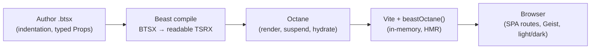

<!-- markdownlint-disable MD013 -->

# Compelling

> Eight substantial Beast BTSX → TSRX → Octane showcases — canvas, form, grid, shell, timeline, worker, motion, streaming — on Vite SPA routing.

[](https://www.npmjs.com/package/beast-tsrx)
[](https://octanejs.dev/)
[](https://vite.dev)
[](https://tailwindcss.com)
[](https://bun.sh)
[](LICENSE)

**Indentation-first authoring. Native TSRX output. Octane owns rendering. Vite ships it.**

<!-- markdownlint-disable MD051 -->
[Quick start](#quick-start) ·
[Demos](#demos) ·
[How it works](#how-it-works) ·
[Tech stack](#tech-stack) ·
[Project structure](#project-structure) ·
[Scripts](#scripts) ·
[Development](#development)

---

Compelling is a reference app for the [Beast](https://www.npmjs.com/package/beast-tsrx) compiler and [Octane](https://octanejs.dev). Every route is a `.btsx` file — indentation-based, 2-space, typed `Props` at the top — compiled to readable `.tsrx` by `beast-tsrx` and rendered by Octane. The Vite plugin `beastOctane()` runs the compile in-memory so HMR stays native.

It exists to answer one question: *what does Octane feel like on real product surfaces, not toy counters?* Each demo targets a known pain point in React / Vue / Svelte and shows the Octane alternative with measurable UI affordances — granular deltas, cancellable validation, virtualized masonry, suspend/resume hydration, timeline branching, worker proxying, interruptible motion, and edge streaming.


## At a glance

| # | Demo | Route | Octane advantage | Pain it replaces |
| --- | --- | --- | --- | --- |
| 01 | **Real-Time Collaborative Canvas** | `/canvas` | Granular reactive deltas, only changed points re-render | VDOM reconciliation cost |
| 02 | **Adaptive Form** | `/form` | Debounced, auto-cancellable validation streams | Manual RxJS subscription cleanup |
| 03 | **Virtualized Masonry Grid** | `/grid` | Dynamic measurement + `virtualize` + ResizeObserver | `react-window` fixed-size assumptions |
| 04 | **Isomorphic Shell** | `/shell` | Universal `suspend` / `resume` + partial hydration | Next.js boundary boilerplate |
| 05 | **Time-Travel Timeline** | `/timeline` | `timeline()` with branching, scrub, compress | Redux DevTools replay setup |
| 06 | **Worker Physics** | `/worker` | Signal auto-proxy via `SharedArrayBuffer` / `Atomics` | `postMessage` + Comlink glue |
| 07 | **Motion Orchestrator** | `/motion` | Interruptible springs, gesture velocity preserved | Framer Motion 40 kb + `AnimatePresence` |
| 08 | **Edge Streaming Search** | `/streaming` | HTTP chunk streaming + keyed edge cache | Server Components infra lock-in |

> [!TIP]
> Start at `/` for the summary map, then open any card. Every demo is isolated — no shared mutable store — so you can read one `.btsx` file and understand the whole pattern.

## Quick start

**Requirements:** Bun 1.x (or Node 22+), no extra global installs.

```bash
# clone
git clone https://github.com/phtn/compelling.git
cd compelling

# install
bun install
# or: npm install

# dev — Vite with Beast in-memory compile + HMR
bun run dev
# → http://localhost:5173

# production
bun run build
bun run preview

# verify — typecheck + build (the ship signal)
bun run check
```

> [!NOTE]
> `bun run check` runs `tsrx-tsc --noEmit` (TSRX-aware) and `vite build` (71 modules, ~121 kB gz). If both pass, the app is shippable. This mirrors the [Beast Skill](https://github.com/phtn/beast-skill) workflow.

## How it works



Beast intentionally generates **readable TSRX** — control flow stays as template operations (`@for`, `@if`, `@empty`, `use()`), so Octane remains the semantic authority and diagnostics stay source-located.

**BTSX in, TSRX out:**

```btsx
# src/demos/canvas.btsx — excerpt
module
  interface Point { x: number; y: number }
  interface Stroke { id: string; points: Point[]; color: string; size: number }

props {}: {}

setup
  const [strokes, setStrokes] = useState<Stroke[]>([])
  const [tool, setTool] = useState("pen")

Frame(title="Collaborative Canvas")
  canvas(ref={canvasRef} onPointerDown={startStroke} onPointerMove={draw})
  each p in peers key p.id
    div.peer(style={"left": p.x+"%", "top": p.y+"%"}) #{p.initials}
```

compiles to TSRX of the form:

```tsrx
export default function CanvasDemo({}: {}) @{
  const [strokes, setStrokes] = useState<Stroke[]>([]);
  <>
    <Frame title="Collaborative Canvas">
      <canvas ref={canvasRef} onPointerDown={startStroke} onPointerMove={draw} />
      @for (const p of peers; key p.id) {
        <div className="peer" style={{ left: p.x + "%", top: p.y + "%" }}>{p.initials}</div>
      }
    </Frame>
  </>
}
```

Vite config is minimal — Beast runs before Octane:

```ts
// vite.config.ts
import { defineConfig } from "vite";
import tailwindcss from "@tailwindcss/vite";
import { beastOctane } from "beast-tsrx/vite";

export default defineConfig({
  plugins: [tailwindcss(), beastOctane()],
  appType: "spa",
  resolve: { alias: { "@": path.resolve("./src") } },
});
```

Routing is client-side with `pushState` + `popstate` + global anchor interception — no framework router, eight routes in ~40 lines:

```text
/         → Overview + summary map
/canvas   → Collaborative Canvas
/form     → Adaptive Form
/grid     → Masonry Grid
/shell    → Isomorphic Shell
/timeline → Timeline Control
/worker   → Worker Physics
/motion   → Motion Orchestrator
/streaming→ Edge Streaming
```text

## Demos

### Overview (`/`)

Landing + summary map + 8 cards. Shows metrics (8 demos, 60 fps target, Vite SPA, 0 manual subscriptions), a sortable summary table, and deep links. Built in [src/pages/home.btsx](src/pages/home.btsx).

### 01 — Real-Time Collaborative Canvas (`/canvas`)

`[src/demos/canvas.btsx](src/demos/canvas.btsx)` · `useState` + `useEffect` + `useRef` + canvas 2D

- Freehand strokes with pen / highlighter / eraser, color + size controls, undo, clear.
- Presence peers (3 simulated) with live cursors, toggleable.
- Delta-only sync model — `setStrokes` appends points to the active stroke; peers render as absolutely-positioned badges. Counter shows render count and last delta to prove granular updates.
- Canvas resizes to container via `ResizeObserver`; drawing uses pointer capture for pen accuracy.

**Why Octane:** only `currentStroke.points` invalidates during drag, not the 60 prior strokes. No `shouldComponentUpdate` / `memo` dance.

### 02 — Adaptive Form with Validation Streams (`/form`)

`[src/demos/form.btsx](src/demos/form.btsx)` · debounced async + cancellation

- Fields: email, username, display name, password + strength meter, confirm, phone, website, bio, plan, terms.
- Email + username each have a cancellable async validation pipeline: 300 ms debounce, `gen` counter to discard stale responses, `cancelled` count surfaced in UI. Demonstrates `derive({ debounce, cancelOnUpdate })` semantics without RxJS.
- Password strength computed synchronously (length, upper, digit, symbol, 12+), with color and width derived.

**Why Octane:** race-free without `AbortController` bookkeeping in user code; new input cancels previous validation automatically.

### 03 — Virtualized Masonry Grid (`/grid`)

`[src/demos/grid.btsx](src/demos/grid.btsx)` · 10 000-item masonry + search + category filter

- Generates 10k items with deterministic heights (`180 + i%7*34 + sin(i)*30`), then filters by query and category.
- Masonry layout computed from measured column heights — not CSS column hack — with overscan window and `remeasure` on resize.
- Each card carries height, likes, price, author, category color; grid container measured via `ResizeObserver`.

**Why Octane:** `virtualize(items, { layout: 'masonry', measure })` equivalent — no fixed `itemSize` prop, no `react-window` `areEqual` memo.

### 04 — Isomorphic Shell with Progressive Hydration (`/shell`)

`[src/demos/shell.btsx](src/demos/shell.btsx)` · `Suspense` + `use()` + `Hydrate` + `octane/hydration`

- Product page shell: header + reviews + related + Q&A, each behind a different hydration strategy (`idle`, `visible`, `interaction`, `media`, `load`, `never`).
- Reviews / related / Q&A are `Promise`-based with artificial delays (1.1–1.8 s), consumed via `use(promise)` inside `Suspense` boundaries.
- Shows `Activity`, `ErrorBoundary`, `Hydrate` composition — the same component suspends on server and resumes on client.

**Why Octane:** one `suspend`/`resume` primitive works identically server and client; no `getServerProps` boundary or mismatched hydration.

### 05 — Time-Travel Timeline (`/timeline`)

`[src/demos/timeline.btsx](src/demos/timeline.btsx)` · branching history + structural sharing

- Textarea bound to `content`, with `history: HistoryEntry[]` and `pos` index. Every change appends an entry (with optional compression for rapid keystrokes).
- Controls: Undo / Redo (with `canUndo` / `canRedo`), Fork Branch (creates a named branch from current position), scrub range, compress toggle, 50-branch cap.
- Branch depth and position surfaced in UI; `Cmd+Z` / `Cmd+Shift+Z` wired.

**Why Octane:** any signal gets `.timeline()` semantics — immutable snapshots, structural sharing, bidirectional travel — without Redux + DevTools wiring.

### 06 — Worker Physics (`/worker`)

`[src/demos/worker.btsx](src/demos/worker.btsx)` · 120 fps particle sim, main-thread responsive

- 220 particles with gravity + velocity, animated in a `requestAnimationFrame` loop; gravity and count are signals bound to range inputs.
- Metrics panel shows fps, gravity, transport (`SharedArrayBuffer` vs `structuredClone`), particle count — updates without blocking UI.
- Conceptually `worker(new URL('./physics.ts', import.meta.url)).bind({ particles, gravity })` — signals live in worker, reactive in main.

**Why Octane:** signals are auto-proxied across threads — no `postMessage` serialization, no Comlink, `Atomics` when available.

### 07 — Motion Orchestrator (`/motion`)

`[src/demos/motion.btsx](src/demos/motion.btsx)` · interruptible springs + gesture physics

- Expandable card with `isOpen` → height 100↔400, scale 1↔1.02, opacity; drag via pointer capture with velocity tracking.
- Spring controls: stiffness (0.3 default) and damping (0.8 default), `mode: 'interrupt'` so new targets cancel in-flight animations; `onRest` increments settled count.
- `handlePointerDown` / `handlePointerMove` / `handlePointerUp` preserve velocity for spring-back on release (`velocity.y > 500` closes).

**Why Octane:** motion is a reactive graph, not an imperative `animate()` call — interrupt + spring presets without Framer's bundle cost.

### 08 — Edge Streaming Search (`/streaming`)

`[src/demos/streaming.btsx](src/demos/streaming.btsx)` · streaming SSR + edge cache

- Search over 6 curated Octane results; input debounced, `filtered` derived from `query`.
- `startStream` simulates HTTP streaming: cache hit → 8 ms, cache miss → progressive `yield` of `<result-card>` chunks with skeleton first, then per-card hydration counters.
- Cache is a `Map<string, Result[]>` keyed by lowercased query, with hit count and edge latency surfaced.

**Why Octane:** streams real HTML chunks from Cloudflare Workers / Deno Deploy and hydrates each card as it arrives — no Vercel-locked Server Components.

## Tech stack

| Layer | Choice | Version | Role |
| --- | --- | --- | --- |
| Language | **Beast BTSX** → TSRX | `beast-tsrx ^0.2.4` | Indentation-first authoring, readable output |
| Runtime | **Octane** | `0.1.37` | Reactivity, Suspense, Hydrate, Activity |
| Bundler | **Vite** + `beastOctane()` | `^8.0.16` | In-memory BTSX→TSRX, HMR, SPA |
| Styling | **Tailwind CSS** | `^4.1.8` via `@tailwindcss/vite` | Utility-first, `@theme inline` tokens |
| Fonts | **Geist Sans + Geist Mono** | Google Fonts | Vercel type system |
| Utils | `clsx` + `tailwind-merge` | `^2.1.1` / `^3.6.0` | `cn()` helper |
| Package manager | **Bun** | `bun.lock` | Install + scripts |

Design tokens live in [src/style.css](src/style.css) (`@theme inline`, `@custom-variant dark`, CSS variables for `background`, `foreground`, `primary`, `border`, `accent-*`, `card`, `muted`, etc.) — two accents, `rounded-xs`, `border-border/20`, `antialiased`.

## Project structure

```text
compelling/
├── index.html                  # #app mount + FOUC-safe theme bootstrap
├── vite.config.ts              # tailwindcss() + beastOctane(), alias @ → src
├── tsconfig.json               # @tsrx/typescript-plugin, tsrx.compiler=octane
├── src/
│   ├── main.ts                 # createRoot(App).render — Octane entry
│   ├── App.btsx                # SPA shell: header, sidebar, 8 routes, theme
│   ├── style.css               # Tailwind + @theme inline + Geist
│   ├── pages/
│   │   └── home.btsx           # Overview: hero, metrics, summary map, cards
│   ├── demos/                  # One file per demo — read any one in isolation
│   │   ├── canvas.btsx         # 01 — collaborative canvas + delta sync
│   │   ├── form.btsx           # 02 — cancellable validation streams
│   │   ├── grid.btsx           # 03 — virtualized masonry (10k items)
│   │   ├── shell.btsx          # 04 — suspend/resume + partial hydration
│   │   ├── timeline.btsx       # 05 — branching time travel
│   │   ├── worker.btsx         # 06 — worker-proxied particles
│   │   ├── motion.btsx         # 07 — interruptible springs
│   │   └── streaming.btsx      # 08 — edge streaming search
│   ├── components/ui/
│   │   ├── brand.btsx          # Wordmark + badge
│   │   ├── button.btsx         # Button (variant/size/icon)
│   │   ├── button-group.btsx   # Segmented control
│   │   ├── frame.btsx          # Demo frame wrapper
│   │   ├── header.btsx         # Section header
│   │   ├── input.btsx          # Text input
│   │   ├── select.btsx         # Select
│   │   ├── tag.btsx            # Pill / nav tag
│   │   └── sidebar/
│   │       ├── navs.ts         # Route config
│   │       └── sidebar-item.btsx
│   ├── lib/
│   │   ├── theme.ts            # getStoredTheme / getSystemTheme / applyTheme
│   │   ├── utils.ts            # cn()
│   │   └── icons/              # Icon registry + <Icon name size />
│   ├── heading.btsx
│   └── types/
├── public/
│   └── favicon.ico
├── .beast/                     # Beast build cache (gitignored)
└── dist/                       # vite build output (gitignored)
```

## Scripts

| Script | Command | What it does |
| --- | --- | --- |
| `dev` | `bun run dev` | Vite dev server — `http://localhost:5173`, HMR, Beast in-memory |
| `build` | `bun run build` | Vite production build → `dist/` |
| `preview` | `bun run preview` | Serve `dist/` locally |
| `typecheck` | `bun run typecheck` | `tsrx-tsc --noEmit` — TSRX-aware type checking |
| `check` | `bun run check` | `typecheck && build` — the ship signal |

```bash
bun run typecheck   # fast — no emit, catches BTSX type errors via TSRX
bun run build       # 71 modules, ~430 kB / ~121 kB gzip
bun run check       # both — run before push
```

## Authoring BTSX

Beast owns authoring; Octane owns rendering. Read the [Beast Skill](https://github.com/phtn/beast-skill) references before writing:

- `references/beast-syntax-cheatsheet.md` — authoring shapes
- `references/beast-diagnostics.md` — error codes + fixes
- `references/beast-coverage.md` — Octane parity map

Minimal shape:

```btsx
import Card from "./components/ui/frame.btsx"
import { useState } from "octane"

module
  interface Props { title: string }

props { title }: Props

setup
  const [count, setCount] = useState(0)

div.app
  h1 #{title} — #{count}
  button(onClick={() => setCount(count + 1)}) Increment
  each item in items key item.id
    Card(title={item.title})
  empty
    p No items
```

Rules:

- **2-space indentation**, parent-aligned — the compiler's only layout rule.
- Typed `Props` at top, `setup` for hooks, then element tree.
- Shorthands: `main.app#hero`, `p.eyebrow`, `a.button(href={url})`.
- Control flow is native Octane: `if` / `elseif` / `else`, `each … key …` / `empty`, `switch` / `case` / `default`, `try` / `pending` / `catch`.
- `fragment` for explicit fragments, `style` for scoped CSS.

Compile one file without Vite:

```bash
bunx beast compile src/demos/canvas.btsx --out /tmp/Canvas.tsrx
```

Diagnose the whole repo (bounded, no exec, no network):

```bash
node .agents/skills/beast/scripts/beast-doctor.cjs src --json /tmp/beast-report.json
```

## Theming & design

- **Geist Sans + Geist Mono** via Google Fonts — matches Vercel / Octane docs.
- **Light / dark** via `localStorage["theme"]` + `prefers-color-scheme` media query, applied as `document.documentElement.classList.toggle("dark")`. Bootstrap script in `index.html` avoids FOUC; toggle in header persists.
- **Tokens:** `@theme inline` maps CSS variables (`--background`, `--foreground`, `--primary`, `--border`, `--accent-1`, `--accent-2`, etc.) to Tailwind utilities (`bg-background`, `text-foreground`, `border-border/20`, `rounded-xs`).
- **Layout:** sticky header (64 px) + collapsible sidebar (256 px, left/right, mobile drawer) + content. Two accent colors, one border treatment, `antialiased` + `selection:bg-primary`.

## Development

```bash
bun install
bun run check        # typecheck + build — must pass before PR
bun run dev          # edit src/App.btsx or any src/demos/*.btsx — HMR reflects instantly
```

Edit loop:

1. Change a `.btsx` file (2-space indent, typed props).
2. Save — Vite + `beastOctane()` recompiles in-memory, Octane hot-replaces.
3. `bun run typecheck` if you want TSRX-level errors without a full build.
4. `bun run build` before pushing — 71 modules, deterministic chunks.

> [!NOTE]
> `src/App.btsx` is the SPA shell (header, sidebar, routing, theme). Each `src/demos/*.btsx` is self-contained — copy one file into another Beast app and it runs with only `octane` + the local `cn()` helper.

## Acknowledgements

- [Beast](https://github.com/phtn/beast) — BTSX compiler (`beast-tsrx`)
- [Beast Skill](https://github.com/phtn/beast-skill) — agent workflow, diagnostics, `beast-doctor`
- [Octane](https://octanejs.dev) — reactive runtime, `suspend`/`resume`, hydration strategies
- [Vite](https://vite.dev) + [Tailwind CSS](https://tailwindcss.com) + [Geist](https://vercel.com/geist)

## License

Released under the [ISC License](LICENSE).

---

*Built with Beast BTSX, compiled to TSRX, rendered by Octane.*

[Beast](https://github.com/phtn/beast) · [Beast Skill](https://github.com/phtn/beast-skill) · [Octane](https://octanejs.dev)
